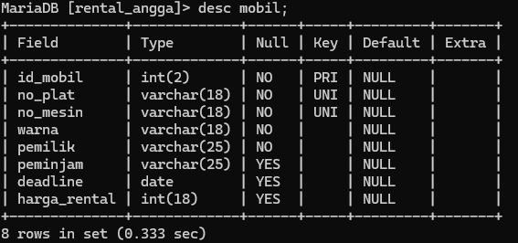
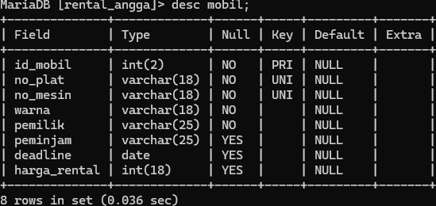
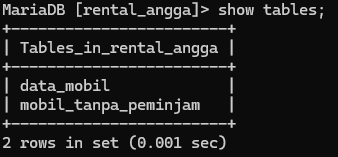

# Alter
## Menambahkan kolom
### Struktrur query
```mysql
ALTER TABLE nama_table ADD nama_kolom_baru varchar(10) AFTER nama_kolom_lama;
```

### Kode Program
```mysql
ALTER TABLE mobil ADD batas_peminjaman varchar(10) AFTER peminjam;
```

### Hasil


### Analisis
- `ALTER TABLE mobil`: Perintah untuk mengubah struktur tabel `mobil`.
- `ADD batas_peminjaman varchar(10)`: Menambahkan kolom baru dengan nama `batas_peminjaman` yang memiliki tipe data `varchar(10)`.
- `AFTER peminjam`: Menentukan bahwa kolom baru akan ditambahkan setelah kolom `peminjam` dalam struktur tabel.

> [!summary]- Kesimpulan
> Perintah ini digunakan untuk menambahkan kolom `batas_peminjaman` dengan tipe data `varchar(10)` ke tabel `mobil` setelah kolom `peminjam`. Dengan menambahkan kolom ini, Anda dapat menyimpan informasi tentang batas peminjaman untuk setiap mobil dalam tabel.


## Mengubah nama kolom
### Struktur query
```mysql
ALTER TABLE nama_table CHANGE COLUMN nama_kolom_lama nama_kolom_baru varchar(10);
```

### Kode program
```mysql
ALTER TABLE mobil CHANGE COLUMN batas_peminjaman deadline varchar(10);
```

### Hasil


### Analisis
- `ALTER TABLE mobil`: Perintah untuk mengubah struktur tabel `mobil`.
- `CHANGE COLUMN batas_peminjaman deadline varchar(10)`: Mengubah kolom `batas_peminjaman` menjadi `deadline` dengan tipe data `varchar(10)`.


> [!summary]- Kesimpulan
> Perintah ini mengubah nama kolom `batas_peminjaman` menjadi `deadline` dan mengubah tipe data menjadi `varchar(10)` dalam tabel `mobil`. Dengan ini, Anda dapat menggunakan nama kolom baru `deadline` untuk menyimpan informasi tentang batas peminjaman untuk setiap mobil dalam tabel.


## Mengubah tipe data kolom
### Struktur query
```mysql
ALTER TABLE nama_table MODIFY nama_kolom tipe_data_baru
```

### Kode Program
```mysql
ALTER TABLE mobil MODIFY deadline DATE;
```


### Hasil



### Analisis
- `ALTER TABLE mobil`: Perintah untuk mengubah struktur tabel `mobil`.
- `MODIFY deadline DATE`: Mengubah tipe data kolom `deadline` menjadi `DATE`.


> [!summary]- Kesimpulan
> Perintah ini mengubah tipe data kolom `deadline` dalam tabel `mobil` menjadi `DATE`. Dengan ini, Anda dapat menggunakan kolom `deadline` untuk menyimpan informasi tentang batas peminjaman dalam format tanggal, yang lebih tepat dan mudah untuk dikelola.


## Menambahkan constraint
### struktur query 
```mysql
ALTER TABLE nama_table ALTER nama_kolom SET DEFAULT 'nama_constraint';
```

### Kode program
```mysql
ALTER TABLE mobil ALTER deadline SET DEFAULT 'Ready';
```

### Hasil


### Analisis
- `ALTER TABLE mobil`: Perintah untuk mengubah struktur tabel `mobil`.
- `ALTER deadline SET DEFAULT 'Ready'`: Mengatur nilai default kolom `deadline` menjadi 'Ready'.

> [!summary]- Kesimpulan
> Perintah ini mengubah nilai default kolom `deadline` dalam tabel `mobil` menjadi 'Ready'. Ini berarti jika tidak ada nilai yang diberikan untuk kolom `deadline` saat sebuah baris dimasukkan ke dalam tabel, maka nilainya akan secara otomatis diatur sebagai 'Ready'.

## Menghapus constraint
### Struktur query 
```mysql 
ALTER TABLE nama_table ALTER nama_kolom DROP DEFAULT;
```

### Kode program
```mysql
ALTER TABLE mobil ALTER deadline DROP DEFAULT;
```

### Hasil


### Analisis
- `ALTER TABLE mobil`: Perintah untuk mengubah struktur tabel `mobil`.
- `ALTER deadline DROP DEFAULT`: Menghapus nilai default yang sebelumnya ditetapkan untuk kolom `deadline`.

> [!summary]- Kesimpulan
> Perintah ini menghapus nilai default yang sebelumnya ditetapkan untuk kolom `deadline` dalam tabel `mobil`. Setelah perintah ini dijalankan, jika tidak ada nilai yang diberikan untuk kolom `deadline` saat sebuah baris dimasukkan ke dalam tabel, maka kolom tersebut akan memiliki nilai NULL.


## Menghapus kolom
### Struktur query
```mysql
ALTER TABLE nama_table DROP COLUMN nama_kolom;
```

### Kode program
```mysql
ALTER TABLE mobil DROP COLUMN deadline
```

### Hasil


### Analisis
- `ALTER TABLE mobil`: Perintah untuk mengubah struktur tabel `mobil`.
- `DROP COLUMN deadline`: Menghapus kolom `deadline` dari tabel `mobil`.

> [!summary]- Kesimpulan
> Perintah ini menghapus kolom `deadline` dari tabel `mobil`. Setelah perintah ini dijalankan, kolom `deadline` akan dihapus dari struktur tabel `mobil` dan tidak akan lagi tersedia untuk digunakan.

## Mengganti nama table
### Struktur query
```mysql
ALTER TABLE nama_table_lama RENAME TO nama_table_baru;
```

### Kode program
```mysql
ALTER TABLE mobil RENAME TO data_mobil;
```

### Hasil


### Analisis
- `ALTER TABLE mobil`: Perintah untuk mengubah tabel dengan nama `mobil`.
- `RENAME TO data_mobil`: Mengubah nama tabel `mobil` menjadi `data_mobil`.

> [!summary]- Kesimpulan
> Perintah ini mengubah nama tabel `mobil` menjadi `data_mobil`. Setelah perintah ini dijalankan, tabel tersebut akan dapat diakses dengan nama baru `data_mobil` dan tidak lagi dengan nama `mobil`.

