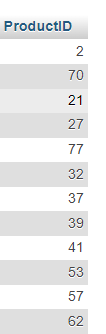

# Table 1 


# Table 2


# QUERY 1
```SQL
SELECT p.ProductID, p.ProductName, od.Quantity, p.UnitsInStock
    -> FROM Products p
    -> INNER JOIN OrderDetails od ON p.ProductID = od.ProductID
    -> ORDER BY p.ProductID ASC;
```
## HASIL


### ANALISIS 
1. **SELECT p.ProductID, p.ProductName, od.Quantity, p.UnitsInStock**

- Bagian ini menentukan kolom-kolom yang akan ditampilkan dalam hasil query. Kolom-kolom tersebut adalah:
    - `p.ProductID`: ID produk dari tabel `Products`.
    - `p.ProductName`: Nama produk dari tabel `Products`.
    - `od.Quantity`: Jumlah produk yang dipesan dari tabel `OrderDetails`.
    - `p.UnitsInStock`: Jumlah unit produk yang tersedia di stok dari tabel `Products`

2. **FROM Products p**
    
    - Bagian ini menentukan tabel utama yang digunakan dalam query, yaitu tabel `Products`. Alias `p` digunakan untuk mempermudah referensi ke tabel ini.

3.  **INNER JOIN OrderDetails od ON p.ProductID = od.ProductID**
    
    - Bagian ini menghubungkan tabel `Products` dengan tabel `OrderDetails` menggunakan klausa `INNER JOIN`. Hubungan dibuat berdasarkan kolom `ProductID` yang ada di kedua tabel tersebut.
    - Alias `od` digunakan untuk tabel `OrderDetails`.

4. **ORDER BY p.ProductID ASC**
    
    - Bagian ini menentukan urutan hasil query berdasarkan kolom `ProductID` dari tabel `Products` secara ascending (menaik).

### Penjelasan Fungsionalitas

Query ini mengambil data dari dua tabel: `Products` dan `OrderDetails`. Untuk setiap produk yang memiliki entri dalam tabel `OrderDetails`, query ini akan menampilkan:

- ID produk (`ProductID`)
- Nama produk (`ProductName`)
- Jumlah produk yang dipesan (`Quantity`)
- Jumlah unit produk yang tersedia di stok (`UnitsInStock`)

Hasil query kemudian diurutkan berdasarkan `ProductID` secara ascending.

# QUERY 2

```sql
SELECT p.ProductID, p.ProductName, p.UnitPrice, od.Quantity, p.UnitsInStock
    -> FROM Products p
    -> LEFT OUTER JOIN OrderDetails od
    -> ON p.ProductID = od.ProductID
    -> ORDER BY p.ProductID ASC;
```
## HASIL 

## ANALISIS 
1. **SELECT p.ProductID, p.ProductName, p.UnitPrice, od.Quantity, p.UnitsInStock**
    
    - Bagian ini menentukan kolom-kolom yang akan ditampilkan dalam hasil query. Kolom-kolom tersebut adalah:
        - `p.ProductID`: ID produk dari tabel `Products`.
        - `p.ProductName`: Nama produk dari tabel `Products`.
        - `p.UnitPrice`: Harga unit produk dari tabel `Products`.
        - `od.Quantity`: Jumlah produk yang dipesan dari tabel `OrderDetails`. Jika tidak ada pesanan untuk produk tertentu, nilai ini akan `NULL`.
        - `p.UnitsInStock`: Jumlah unit produk yang tersedia di stok dari tabel `Products`.
2.  **FROM Products p**
    
    - Bagian ini menentukan tabel utama yang digunakan dalam query, yaitu tabel `Products`. Alias `p` digunakan untuk mempermudah referensi ke tabel ini.
3.  **LEFT OUTER JOIN OrderDetails od ON p.ProductID = od.ProductID**
    
    - Bagian ini menghubungkan tabel `Products` dengan tabel `OrderDetails` menggunakan klausa `LEFT OUTER JOIN`. Hubungan dibuat berdasarkan kolom `ProductID` yang ada di kedua tabel tersebut.
    - Alias `od` digunakan untuk tabel `OrderDetails`.
    - `LEFT OUTER JOIN` memastikan semua baris dari tabel `Products` akan ditampilkan, bahkan jika tidak ada entri yang sesuai di tabel `OrderDetails`. Jika tidak ada kecocokan, kolom dari tabel `OrderDetails` (seperti `Quantity`) akan mengandung nilai `NULL`.

4. **ORDER BY p.ProductID ASC**
    
    - Bagian ini menentukan urutan hasil query berdasarkan kolom `ProductID` dari tabel `Products` secara ascending (menaik).

### Penjelasan Fungsionalitas

Query ini mengambil data dari dua tabel: `Products` dan `OrderDetails`. Untuk setiap produk, query ini akan menampilkan:

- ID produk (`ProductID`)
- Nama produk (`ProductName`)
- Harga unit produk (`UnitPrice`)
- Jumlah produk yang dipesan (`Quantity`, jika ada; jika tidak, akan bernilai `NULL`)
- Jumlah unit produk yang tersedia di stok (`UnitsInStock`)

Hasil query kemudian diurutkan berdasarkan `ProductID` secara ascending.

# QUERY 3

```sql
SELECT p.ProductID, p.ProductName, p.UnitPrice, od.Quantity, p.UnitsInStock
    -> FROM Products p
    -> RIGHT OUTER JOIN OrderDetails od
    -> ON p.ProductID = od.ProductID
    -> ORDER BY p.ProductID ASC;
```
## HASIL 


## ANALISIS 
1. **SELECT p.ProductID, p.ProductName, p.UnitPrice, od.Quantity, p.UnitsInStock**
    
    - Bagian ini menentukan kolom-kolom yang akan ditampilkan dalam hasil query. Kolom-kolom tersebut adalah:
        - `p.ProductID`: ID produk dari tabel `Products`.
        - `p.ProductName`: Nama produk dari tabel `Products`.
        - `p.UnitPrice`: Harga unit produk dari tabel `Products`.
        - `od.Quantity`: Jumlah produk yang dipesan dari tabel `OrderDetails`.
        - `p.UnitsInStock`: Jumlah unit produk yang tersedia di stok dari tabel `Products`.
2. **FROM Products p**
    
    - Bagian ini menentukan tabel utama yang digunakan dalam query, yaitu tabel `Products`. Alias `p` digunakan untuk mempermudah referensi ke tabel ini.
3. **RIGHT OUTER JOIN OrderDetails od ON p.ProductID = od.ProductID**
    
    - Bagian ini menghubungkan tabel `Products` dengan tabel `OrderDetails` menggunakan klausa `RIGHT OUTER JOIN`. Hubungan dibuat berdasarkan kolom `ProductID` yang ada di kedua tabel tersebut.
    - Alias `od` digunakan untuk tabel `OrderDetails`.
    - `RIGHT OUTER JOIN` memastikan semua baris dari tabel `OrderDetails` akan ditampilkan, bahkan jika tidak ada entri yang sesuai di tabel `Products`. Jika tidak ada kecocokan, kolom dari tabel `Products` (seperti `ProductID`, `ProductName`, `UnitPrice`, dan `UnitsInStock`) akan mengandung nilai `NULL`.
4. **ORDER BY p.ProductID ASC**
    
    - Bagian ini menentukan urutan hasil query berdasarkan kolom `ProductID` dari tabel `Products` secara ascending (menaik). Namun, karena `ProductID` dari tabel `Products` dapat bernilai `NULL` jika tidak ada kecocokan, hasil urutannya mungkin tidak sepenuhnya intuitif.

### Penjelasan Fungsionalitas

Query ini mengambil data dari dua tabel: `Products` dan `OrderDetails`. Untuk setiap entri di tabel `OrderDetails`, query ini akan menampilkan:

- ID produk (`ProductID`)
- Nama produk (`ProductName`)
- Harga unit produk (`UnitPrice`)
- Jumlah produk yang dipesan (`Quantity`)
- Jumlah unit produk yang tersedia di stok (`UnitsInStock`)

Jika tidak ada kecocokan di tabel `Products` untuk entri di tabel `OrderDetails`, kolom dari tabel `Products` akan bernilai `NULL`.

Hasil query kemudian diurutkan berdasarkan `ProductID` dari tabel `Products` secara ascending. Namun, karena `RIGHT OUTER JOIN` digunakan, urutan `ProductID` dapat mengandung nilai `NULL`.

# Query 4
```mysql
SELECT ProductsID FROM products UNION SELECT ProductID FROM OrderDetails;
```


- SELECT untuk memilih kolom mana saja Yang ingin ditampilkan dan dari tabel mana kolom tersebut dipilih.
- Product ID: Adalah nama kolom yang dipilih unutk digabungkan .
- From Products = untuk memilih dari tabel mana saja data kolomnya akan digabung.
- UNION = untuk melakukan dua SELECT, data Yang tampil adalah hasil gabungan dari tobel Products dengan OrderDetails. Tapi tampilannya tidak menampil duplikat dan banča tampilan Distinct (Harta menampilkan masing-masing Satu).
- SELECT untuk memilih kolam apa saja yang ingin ditampilkan
- ProductID= adalah nama kolom yang dipilih untuk digabungkan.
- From soles untur memilih dari tabel mana sara Xing data kolonnya akan dibaland Hasilnya merupakan hasil Sabundan dari tabel Productsdummy dan Sales Farom ProductID merupakan kolam Yang datanya dilabuni namun data duplikać terhapus/tidak ditampilkan karena tampilan undan adalah Distinct


# Query 5

```mysql
SELECT ProductID FROM products UNION ALL SELECT ProductID FROM OrderDetails;
```

## Hasil


- SELECT = untuk memilih kolom mana saja yang ingin ditampilkan/digabung.
- FROM Products = untuk memilih dari tabel mana saja yang data kolomnya akan digabung
- ProductID = adalah nama kolom yang dipilih untuk digabungkan
- UNION ALL = untuk menggabung suatu kolom dan tabel. Dan menampilkan semua Data termasuk yang duplikat.
- SELECT = untuk memilih kolom mana saja yang ingin di tampilkan/digabung
- ProductID = adalah nama kolom yang dipilih untuk digabungkan
- FROM OrderDetails = untuk memilih dari tabel mana saja yang data kolomnya akan digabung   
- Hasilnya = semua data termasuk data duplikat akan di tampilkan semua. Dari tabel Products dan OrderDetails

# Query 6
## Kode Program
```mysql
SELECT ProductID FROM products INTERSECT SELECT ProductID FROM OrderDetails;
```


## Hasil


- SELECT = untuk memilih kolom mana saja yang ingin ditampilkan/digabung
- Product ID = adalah nama kolam Yand dipilih untut digabungkan.
- From Products = untuk memilih dari tabel mana saja yang data kolomnya akan digabung
- INTERSECT = untut menampilkan gabungan dari tabel Products dan OrderDetails tapi hanya data Yang Sama/identik
- SELECT = untuk memilih kolom mana saja yang ingin ditampilkan / digabung 
- ProductID= adalah nama kolom Yang dipilih untuk digabungkan.
- From OrderDetails = untuk memilih dari tabel mana saja yang data kolamnya akan digabung
- Hasilnya  = hanya data yang sama dengan antarkolom pada dua tabel yang tampil.


# nomor 7
## Query 
```mysql
SELECT productID FROM productsdumy
EXCEPT
SELECT productID FROM sales; 
```
## Hasil query

## Analisis
`SELECT` : untuk memilih kolom mana saja yang ingin ditampilkan / digabung.
`productID` : nama kolom yang dipilih untuk digabungkan.
`FROM productsdumy` : untuk memilih dari tabel mana saja yang data kolomnya akan digabungkan.
`EXCEPT` : untuk menampilkan gabungan dari productsdumy dan sales tapi hanya data yang tidak sama.
`SELECT` : untuk memilih kolom mana saja yang ingin ditampilkan / digabung.
`productID` : nama kolom yang dipilih untuk digabungkan.
`FROM sales` : untuk memilih dari tabel mana saja yang data kolomnya akan di gabung.
HASILNYA : hanya 4 yang tidak memiliki data yang sama.
## TABEL productsdumy

## TABEL Sales

# nomor 8
## Query
```mysql
SELECT pegawai.ID, pegawai.Nama, departemen.IdDep, departemen.Departemen
FROM pegawai
CROSS JOIN departemen
ORDER BY pegawai.ID ASC;
```
## Hasil query

## Analisis
`SELECT` : untuk memilih kolom mana saja yang ingin ditampilkan / digabung.
`pegawai.ID, pegawai.Nama` : kolom ID dan nama dari tabel pegawai dipilih.
`departemen.IdDep, departemen.Departemen` : kolom IdDep dan Departemen dari tabel departemen dipilih untuk digabungkan.
`FROM pegawai` : untuk memilih dari tabel mana data kolomnya dipilih yaitu pegawai.
`CROSS JOIN` : untuk menggabung data kolom secara bersilang (masing-masing kolom digabungkan).
`departemen` : nama kabel yang digabung. 
`ORDER BY pegawai.ID ASC` : untuk mengurutkan data berdasarkan kolom ID dari pegawai secara (Ascending) terkecil ke terbesar.
HASILNYA : masing-masing data kolom digabung satu sama lain, Jeijo dengan HRD dan Marketing, Gianna dengan HRD dan Marketing.
## TABEL pegawai

## TABEL departemen

