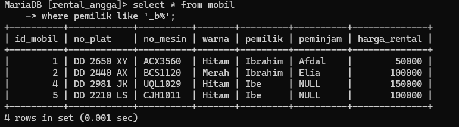
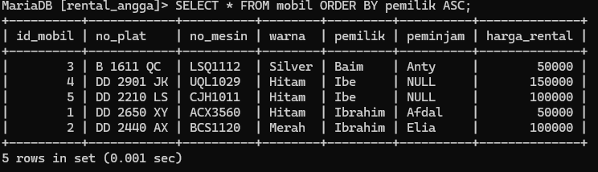
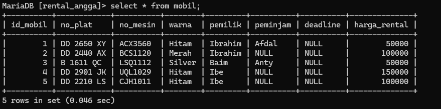

# AND 
## Struktur
```mysql
select kolom1,kolom2 from nama_table where kolom1='nilai_kolom1' and kolom2='nilai_kolom2';
```

## Contoh
```mysql
select warna,pemilik from mobil where warna='hitam' and pemilik='ibrahim'
```

## Hasil


## Analisis
1. `select` query yang digunakan untuk menampilkan masukan dari `insert`
2. `warna,pemilik` merupakan nama kolom dari mobil
3. `from` query yang digunakan untuk memberi tanda bahwa tabel mana yang akan di tampilak
4. `where` query yang digunakan untuk memberikan sebuah kondisi
5. `warna='hitam' and pemilik='ibrahim'` merupakan sebuah kondisi untuk query dan `and` digunakan untuk memberikan syarat yang keduanya harus di penuhi 

> [!summary] Kesimpulan
> jika ingin menampilakan data yang telah di seleksi dengan cara memberikan syarat yang semuanya harus di penuhi kalian bisa menggunakan query dengan struktur 
> `select kolom1,kolom2 from nama_table where kolom1='nilai_kolom1' and kolom2='nilai_kolom2';`

# OR
## Struktur
```mysql
select kolom1,kolom2 from nama_table where kolom1='nilai_kolom1' or kolom2='nilai_kolom2';
```

## Contoh
```mysql
select warna,pemilik from mobil where warna='Hitam' or pemilik='Ibrahim';
```

## Hasil


## Analisis
1. `select` query yang digunakan untuk menampilkan masukan dari `insert`
2. `warna,pemilik` merupakan nama kolom dari mobil
3. `from` query yang digunakan untuk memberi tanda bahwa tabel mana yang akan di tampilak
4. `where` query yang digunakan untuk memberikan sebuah kondisi
5. `warna='hitam' or pemilik='ibrahim'` merupakan sebuah kondisi untuk query dan `or` digunakan untuk memberikan syarat yang salah satunya harus di penuhi 

> [!summary] Kesimpulan
> jika kalian ingin menampilakan data tabel dari kolom yang nilainya telah di seleksi dengan cara memberikan syarat yang salah satunya harus di penuhi kalian bisa menggunakan query dengan struktur  `select warna,pemilik from mobil where warna='Hitam' or pemilik='Ibrahim';`

# Between

## Struktur
```mysql
select * from nama_table where nama_kolom between nilai1 and nilai2;
```

## Contoh
```mysql
select * from mobil where harga_rental between 100000 and 150000;
```


## Hasil


## Analisis
1. `select` query yang digunakan untuk menampilkan masukan dari `insert`
2. `*`  berarti semua kolom akan di tampilkan
3. `from` untuk memberikan tanda bahwa table mana yang akan di tampilkan
4. `mobil` nama table yang akan di tampilkan
5. `where` untuk memberikan sebuah kondisi
6. `harga_rental` nama kolom yang digunakan untuk mengkondisikan sebuah table
7. `between` Ini adalah operator yang digunakan untuk memilih rentang nilai
8. `100000 and 150000` Ini adalah nilai rentang yang digunakan dalam kriteria pemilihan data

> [!summary] Kesimpulan
> Jika ingin menampilakan hasil dari menyeleksi table dengan cara memberikan sebuah rentang nilai kalian bisa menggunakan sebuah query dengean struktur `select * from nama_table where nama_kolom between nilai1 and nilai2;`


# Not Between
## Struktur
```mysql
select * from nama_table where nama_kolom not between nilai1 and nilai2;
```

## Contoh
```mysql
select * from mobil where harga_rental not between 100000 and 150000;
```


## Hasil


## Analisis
1. `select` query yang digunakan untuk menampilkan masukan dari `insert`
2. `*`  berarti semua kolom akan di tampilkan
3. `from` untuk memberikan tanda bahwa table mana yang akan di tampilkan
4. `mobil` nama table yang akan di tampilkan
5. `where` untuk memberikan sebuah kondisi
6. `harga_rental` nama kolom yang digunakan untuk mengkondisikan sebuah table
7. `not between` Ini adalah operator yang digunakan untuk memilih nilai di luar rentang tertentu.
8. `100000 and 150000` Ini adalah nilai rentang yang digunakan dalam kriteria pemilihan data

> [!summary] Kesimpulan
> Jika ingin menampilakan hasil dari menyeleksi table dengan cara memberikan sebuah rentang nilai yang beda nya sebelumnya itu jika nilai tersebut masih berada di dalam rentang nilai yang diberikan maka akan di tampilkan sedangkan kali ini di luar dari rentang nilai yang akan di tampilkan untuk itu kalian bisa menggunakan sebuah query dengan struktur `select * from nama_table where nama_kolom not between nilai1 and nilai2;`
# <=
## Struktur
```mysql
select * from nama_table where nama_kolom<=nilai;
```

## Contoh
```mysql
select * from mobil where harga_rental<=50000;
```


## Hasil


## Analisis
1. `select` query yang digunakan untuk menampilkan hasil dari `insert`
2. `*` arti nya semua kolom akan ditampilkan
3. `from` query yang digunakan untuk memberikan penanda bahwa table mana yang akan di tampilkan
4. `mobil` nama table yang akan ditampilkan
5. `where` query yang digunakan untuk memberikan sebuah kondisi
6. `harga_rental<=50000` sebuah kondisi yang telah di berikan dan `harga_rental` itu nama kolom, `<=` merupakan operator, dan `50000`merupakan sebuah nilai

> [!summary] Kesimpulan
> jika ingin menampilkan table dengan menggunakan hasil seleksi yang dimana jika dia lebih kecil dari nilai yang di tentukan maka dia akan tampil, yaitu dengan cara menggunakan query dengan struktur `select * from nama_table where nama_kolom<=nilai;`

# >=
## Struktur
```mysql
select * from nama_table where nama_kolom>=nilai;
```

## Contoh
```mysql
select * from mobil where harga_rental>=50000
```


## Hasil


## Analisis
1. `select` query yang digunakan untuk menampilkan hasil dari `insert`
2. `*` arti nya semua kolom akan ditampilkan
3. `from` query yang digunkan untuk memberikan penanda bahwa table mana yang akan di tampilkan
4. `mobil` nama table yang akan ditampilkan
5. `where` query yang digunakan untuk memberikan sebuah kondisi
6. `harga_rental>=50000` sebuah kondisi yang telah di berikan dan `harga_rental` itu nama kolom, `>=` merupakan operator, dan `50000`merupakan sebuah nilai

>[!summary] Kesimpulan
> jika ingin menampilkan table dengan menggunakan hasil seleksi yang dimana jika dia lebih besar dari nilai yang di tentukan maka dia akan tampil, yaitu dengan cara menggunakan query dengan struktur `select * from nama_table where nama_kolom<=nilai;`
# <> atau !=
## Struktur1
```mysql
select * from nama_table where nama_kolom<>nilai;
```

## Struktur2
```mysql
select * from nama_table where nama_kolom!=nilai;
```
## Contoh1
```mysql
select * from mobil where harga_rental<>50000; 
```

## Contoh2
```mysql
select * from mobil where harga_rental!=50000; 
```


## Hasil1


## Hasil2


## Analisis1
1. `select` query yang digunakan untuk menampilkan hasil dari `insert`
2. `*` arti nya semua kolom akan ditampilkan
3. `from` query yang digunkan untuk memberikan penanda bahwa table mana yang akan di tampilkan
4. `mobil` nama table yang akan ditampilkan
5. `where` query yang digunakan untuk memberikan sebuah kondisi
6. `harga_rental<>50000` sebuah kondisi yang telah di berikan dan `harga_rental` itu nama kolom, `<>` merupakan operator, dan `50000` merupakan sebuah nilai

## Analisis2
1. `select` query yang digunakan untuk menampilkan hasil dari `insert`
2. `*` arti nya semua kolom akan ditampilkan
3. `from` query yang digunkan untuk memberikan penanda bahwa table mana yang akan di tampilkan
4. `mobil` nama table yang akan ditampilkan
5. `where` query yang digunakan untuk memberikan sebuah kondisi
6. `harga_rental!=50000` sebuah kondisi yang telah di berikan dan `harga_rental` itu nama kolom, `!=` merupakan operator, dan `50000`merupakan sebuah nilai

> [!summary]
> dari kedua contoh operator kita bisa menyimpulkan bahwa operator `!=` dengan `<>` memiliki arti yang sama yang dimana jika ingin menampilakan table dengan menggunakan sebauh nilai maka nilai yang ingin di tampilakan tidak boleh sama dengan nilai yang telah di tentukan

# Tantangan Login
## Struktur
```mysql
select nama_kolom1 from nama_table where nama_kolom2=nilai;
```

## Contoh
```mysql
select pemilik from mobil where no_plat="DD 2560 XY";
```

## Hasil


## Analisis
1. `select` query yang digunakan untuk menampilkan sebuah table
2. `pemilik` nama kolom yang dimana hanya isi dari kolom ini yang akan di tampilkan
3. `from` query yang digunakan untuk memberikan sebuah tanda ke table yang akan di tampilkan 
4. `mobil` nama table yang akan di tampilkan
5. `where` query yang digunakan untuk memberikan sebuah kondisi 
6. `no_plat="DD 2560 XY"` sebuah kondisi yang telah diberikan. `no_plat` adalah nama kolom, `=` adalah operator, dan `"DD 2560 XY"` adalah nilai.

> [!summary]
> jika ingin menampilkan dari hasil seleksi yang dimana hanya ada satu nilai dari satu kolom aka di tampilkan, yaitu dengan cara menggunakan query dengan struktur `select nama_kolom1 from nama_table where nama_kolom2=nilai;`

> [!NOTE] Catatan 
> `nama_kolom2` harus kolom yang menggunakan constraint unique 

# IN
## IN
### Struktur
```mysql
select * from nama_table where nama_kolom in('nilai_kolom');
```

## Contoh
```mysql
select * from mobil where warna in('Hitam','Silver');
```


### Hasil


### Analisis
1. `SELECT *` artinya kita akan mengambil semua kolom dari tabel "mobil".
2. `FROM mobil` artinya kita akan mengambil data dari tabel "mobil".
3. `WHERE warna IN ('Hitam', 'Merah')` artinya kita hanya akan mengambil baris-baris di mana nilai kolom "warna" adalah "Hitam" atau "Silver".

>[!summary]- Kesimpulan
>Perintah `SELECT *` digunakan untuk mengambil semua kolom dari tabel "mobil". Selanjutnya, `FROM mobil` menunjukkan bahwa data diambil dari tabel "mobil". Klausa `WHERE warna IN ('Hitam', 'Merah')` digunakan untuk memfilter baris-baris di mana nilai kolom "warna" adalah "Hitam" atau "Merah". Jadi, query ini akan mengembalikan baris-baris di mana nilai kolom "warna" adalah "Hitam" atau "Merah".
 
 
## IN + AND
### Struktur
```mysql
select * from nama_table 
where nama_kolom in('nilai_kolom')
and nama_kolom = nilai_kolom;
```

### Contoh 
```mysql
select * from mobil
where warna in('Hitam','Merah')
and harga_rental = 50000;
```

### Hasil


### Analisis
1.  `SELECT *` artinya kita akan mengambil semua kolom dari tabel "mobil".
2. `FROM mobil` artinya kita akan mengambil data dari tabel "mobil".
3. `WHERE warna IN ('Hitam', 'Merah')` artinya kita hanya akan mengambil baris-baris di mana nilai kolom "warna" adalah "Hitam" atau "Silver".
4. `AND harga_rental = 50000` artinya kita hanya akan mengambil baris-baris di mana nilai kolom "harga_rental" adalah 50000.

>[!summary]- Kesimpulan
>Perintah `SELECT *` digunakan untuk mengambil semua kolom dari tabel "mobil". Selanjutnya, `FROM mobil` menunjukkan bahwa data diambil dari tabel "mobil". Klausa `WHERE warna IN ('Hitam', 'Merah')` digunakan untuk memfilter baris-baris di mana nilai kolom "warna" adalah "Hitam" atau "Merah". Selain itu, `AND harga_rental = 50000` digunakan untuk memfilter baris-baris di mana nilai kolom "harga_rental" adalah 50000. Jadi, query ini akan mengembalikan baris-baris di mana nilai kolom "warna" adalah "Hitam" atau "Merah", dan nilai kolom "harga_rental" adalah 50000.
 
 
## IN+OR
### Struktur
```mysql
select * from nama_table
where nama_kolom in('nilai_kolom')
or nama_kolom = nilai_kolom;
```


### Contoh
```mysql
select * from mobil
where warna in('Hitam','Silver')
or harga_rental = 50000;
```


### Hasil


### Analisis
- `SELECT *`: Memilih semua kolom dari tabel.
- `FROM mobil`: Menunjukkan bahwa data diambil dari tabel `mobil`.
- `WHERE warna IN ('Hitam', 'Silver') OR harga_rental = 50000`: Menggunakan klausa WHERE untuk memfilter baris berdasarkan kondisi bahwa nilai kolom `warna` adalah 'Hitam' atau 'Silver', atau nilai kolom `harga_rental` adalah 50000.

>[!summary]- Kesimpulan
 >Perintah `SELECT *` digunakan untuk memilih semua kolom dari tabel. Selanjutnya, `FROM mobil` menunjukkan bahwa data diambil dari tabel `mobil`. Klausa `WHERE warna IN ('Hitam', 'Silver') OR harga_rental = 50000` digunakan untuk memfilter baris berdasarkan kondisi bahwa nilai kolom `warna` adalah 'Hitam' atau 'Silver', atau nilai kolom `harga_rental` adalah 50000. Dengan demikian, query ini akan mengembalikan baris-baris di mana nilai kolom `warna` adalah 'Hitam' atau 'Silver', atau nilai kolom `harga_rental` adalah 50000.

## IN+AND+OPERATOR
### Struktur1
```mysql
select * from nama_table
where nama_kolom in('nilai_kolom')
or nama_kolom > nilai_kolom; 
```

### Contoh1
```mysql
select * from mobil 
where warna in('Hitam','Silver')
or harga_rental > 50000;
```

### Hasil1


### Analisis1
1. `SELECT *` artinya kita akan mengambil semua kolom dari tabel "mobil".
2. `FROM mobil` artinya kita akan mengambil data dari tabel "mobil".
3. `WHERE warna IN ('Hitam', 'Merah')` artinya kita hanya akan mengambil baris-baris di mana nilai kolom "warna" adalah "Hitam" atau "Silver".
4. `OR harga_rental > 50000` artinya kita juga akan mengambil baris-baris di mana nilai kolom "harga_rental" lebih besar dari 50000.

>[!summary]- Kesimpulan
 >Perintah `SELECT *` digunakan untuk mengambil semua kolom dari tabel "mobil". Selanjutnya, `FROM mobil` menunjukkan bahwa data diambil dari tabel "mobil". Klausa `WHERE warna IN ('Hitam', 'Merah')` digunakan untuk memfilter baris-baris di mana nilai kolom "warna" adalah "Hitam" atau "Merah". Selain itu, `OR harga_rental > 50000` digunakan untuk juga memfilter baris-baris di mana nilai kolom "harga_rental" lebih besar dari 50000. Jadi, pernyataan ini akan mengambil baris-baris di mana nilai kolom "warna" adalah "Hitam" atau "Merah", atau di mana nilai kolom "harga_rental" lebih besar dari 50000.

### Struktur2
```mysql
select * from nama_table
where nama_kolom in('nilai_kolom')
or nama_kolom < nilai_kolom; 
```

### Contoh2
```mysql
select * from mobil 
where warna in('Hitam','Merah')
or harga_rental < 100000;
```

### Hasil


### Analisis
1. `SELECT *` artinya kita akan mengambil semua kolom dari tabel "mobil".
2. `FROM mobil` artinya kita akan mengambil data dari tabel "mobil".
3. `WHERE warna IN ('Hitam', 'Merah')` artinya kita hanya akan mengambil baris-baris di mana nilai kolom "warna" adalah "Hitam" atau "Silver".
4. `OR harga_rental < 100000` artinya kita juga akan mengambil baris-baris di mana nilai kolom "harga_rental" kurang dari 100000.

>[!summary]- Kesimpulan
 >Perintah `SELECT *` digunakan untuk mengambil semua kolom dari tabel "mobil". Selanjutnya, `FROM mobil` menunjukkan bahwa data diambil dari tabel "mobil". Klausa `WHERE warna IN ('Hitam', 'Merah')` digunakan untuk memfilter baris-baris di mana nilai kolom "warna" adalah "Hitam" atau "Merah". Selain itu, `OR harga_rental < 100000` digunakan untuk juga memfilter baris-baris di mana nilai kolom "harga_rental" kurang dari 100000. Jadi, pernyataan ini akan mengambil baris-baris di mana nilai kolom "warna" adalah "Hitam" atau "Merah", atau di mana nilai kolom "harga_rental" kurang dari 100000.

# LIKE

## Mencari Awalan 
### Struktur
```mysql
select * from nama_table 
where nama_kolom like 'awalan nilai kolom';
```

### Contoh
```mysql
select * from mobil
where pemilik like 'Ib%';
```

### Hasil


### Analisis
1. `SELECT *` artinya kita akan mengambil semua kolom dari tabel "mobil".
2. `FROM mobil` artinya kita akan mengambil data dari tabel "mobil".
3. `WHERE pemilik LIKE 'Ib%'` artinya kita hanya akan mengambil baris-baris di mana nilai kolom "pemilik" dimulai dengan kata "Ib" (dilanjutkan dengan karakter apa pun, karena simbol `%` dalam pola pencocokan).

>[!summary]- Kesimpulan
>Perintah `SELECT *` digunakan untuk mengambil semua kolom dari tabel "mobil". Selanjutnya, `FROM mobil` menunjukkan bahwa data diambil dari tabel "mobil". Klausa `WHERE pemilik LIKE 'Ib%'` digunakan untuk memfilter baris-baris di mana nilai kolom "pemilik" dimulai dengan kata "Ib" (dilanjutkan dengan karakter apa pun, karena simbol `%` dalam pola pencocokan). Jadi, pernyataan ini akan mengambil baris-baris di mana nilai kolom "pemilik" memenuhi pola tersebut.
 
 
## Mencari Akhiran
### Struktur
```mysql
select * from nama_table
where nama_kolom like 'ahiran nilai kolom';
```


### Contoh
```mysql
select * from mobil
where pemilik like '%m';
```


### Hasil


### Analisis
1. `SELECT *` artinya kita akan mengambil semua kolom dari tabel "mobil".
2. `FROM mobil` artinya kita akan mengambil data dari tabel "mobil".
3. `WHERE pemilik LIKE '%m'` artinya kita hanya akan mengambil baris-baris di mana nilai kolom "pemilik" diakhiri dengan huruf "m" (dimulai dengan karakter apa pun, karena simbol `%` sebelum "m" dalam pola pencocokan).


>[!summary]- Kesimpulan
 >Perintah `SELECT *` digunakan untuk mengambil semua kolom dari tabel "mobil". Selanjutnya, `FROM mobil` menunjukkan bahwa data diambil dari tabel "mobil". Klausa `WHERE pemilik LIKE '%m'` digunakan untuk memfilter baris-baris di mana nilai kolom "pemilik" diakhiri dengan huruf "m" (dimulai dengan karakter apa pun, karena simbol `%` sebelum "m" dalam pola pencocokan). Jadi, pernyataan ini akan mengambil baris-baris di mana nilai kolom "pemilik" memenuhi pola tersebut.

## Mencari Awalan & Akhiran

### Struktur
```mysql
select * from nama_table
where nama_kolom like 'awalan nilai kolom'
```


### Contoh 
```mysql
select * from mobil
where pemilik like 'b%m'
```


### Hasil


### Analisis
1. `SELECT *` artinya kita akan mengambil semua kolom dari tabel "mobil".
2. `FROM mobil` artinya kita akan mengambil data dari tabel "mobil".
3. `WHERE pemilik LIKE 'b%m'` artinya kita hanya akan mengambil baris-baris di mana nilai kolom "pemilik" dimulai dengan huruf "b", diikuti oleh setidaknya satu karakter apa pun (dilambangkan oleh simbol `%`), dan diakhiri dengan huruf "m".

>[!summary]- Kesimpulan
 >Perintah `SELECT *` digunakan untuk mengambil semua kolom dari tabel "mobil". Selanjutnya, `FROM mobil` menunjukkan bahwa data diambil dari tabel "mobil". Klausa `WHERE pemilik LIKE 'b%m'` digunakan untuk memfilter baris-baris di mana nilai kolom "pemilik" dimulai dengan huruf "b", diikuti oleh setidaknya satu karakter apa pun (dilambangkan oleh simbol `%`), dan diakhiri dengan huruf "m". Jadi, pernyataan ini akan mengambil baris-baris di mana nilai kolom "pemilik" memenuhi pola tersebut.

## Mencari Berdasarkan Total Karakter
### Struktur1
```mysql
select * from nama_table
	where nama_kolom like 'jumlah karakter pada nilai kolom'
```

### Contoh1
```mysql
select * from mobil
where pemilik like 'I__';
```


### Hasil1


### Analisis1
1. `SELECT *` artinya kita akan mengambil semua kolom dari tabel "mobil".
2. `FROM mobil` artinya kita akan mengambil data dari tabel "mobil".
3. `WHERE pemilik LIKE 'I__'` artinya kita hanya akan mengambil baris-baris di mana nilai kolom "pemilik" terdiri dari 3 karakter, di mana karakter pertama adalah "I" (dilambangkan oleh underscore `_`) dan dua karakter berikutnya adalah karakter apa pun.

>[!summary]- Kesimpulan
 >Perintah `SELECT *` digunakan untuk mengambil semua kolom dari tabel "mobil". Selanjutnya, `FROM mobil` menunjukkan bahwa data diambil dari tabel "mobil". Klausa `WHERE pemilik LIKE 'I__'` digunakan untuk memfilter baris-baris di mana nilai kolom "pemilik" terdiri dari 3 karakter, di mana karakter pertama adalah "I" (dilambangkan oleh underscore `_`) dan dua karakter berikutnya adalah karakter apa pun. Jadi, pernyataan ini akan mengambil baris-baris di mana nilai kolom "pemilik" memenuhi pola tersebut.

### Struktur2
```mysql
select * from nama_table
	where nama_kolom like 'jumlah karakter pada nilai kolom'
```


### Contoh2
```mysql
select * from mobil
where pemilik like '___';
```


### Hasil2


### Analisis
1. `SELECT *` artinya kita akan mengambil semua kolom dari tabel "mobil".
2. `FROM mobil` artinya kita akan mengambil data dari tabel "mobil".
3. `WHERE pemilik LIKE '___'` artinya kita hanya akan menampilakan sebuah tabel dengan syarat nilai pemilik harus memiliki 3 huruf

>[!summary]- Kesimpulan
 >Perintah `SELECT *` digunakan untuk mengambil semua kolom dari tabel "mobil". Selanjutnya, `FROM mobil` menunjukkan bahwa data diambil dari tabel "mobil". Klausa `WHERE pemilik LIKE '___'` digunakan untuk menampilkan tabel dengan syarat nilai kolom "pemilik" harus memiliki tepat 3 huruf. Jadi, pernyataan ini akan menampilkan baris-baris di mana nilai kolom "pemilik" memiliki tepat 3 huruf.

## Kombinasi
### Struktur1
```mysql
select * from nama_table
where nama_kolom like 'nilai kolom'
```

### Contoh1
```mysql
select * from mobil 
where pemilik like '__r%'
```


### Hasil1


### Analisis1
1. `SELECT *` artinya kita akan mengambil semua kolom dari tabel "mobil".
2. `FROM mobil` artinya kita akan mengambil data dari tabel "mobil".
3. `WHERE pemilik LIKE '__r%'` artinya kita hanya akan mengambil baris-baris di mana nilai kolom "pemilik" terdiri dari setidaknya 3 karakter, di mana dua karakter pertama adalah karakter apa pun (dilambangkan oleh dua underscore `_`), karakter ketiga adalah "r", dan karakter-karakter berikutnya adalah karakter apa pun (dilambangkan oleh simbol `%`).

>[!summary]- Kesimpulan
 >Perintah `SELECT *` digunakan untuk mengambil semua kolom dari tabel "mobil". Selanjutnya, `FROM mobil` menunjukkan bahwa data diambil dari tabel "mobil". Klausa `WHERE pemilik LIKE '__r%'` digunakan untuk memfilter baris-baris di mana nilai kolom "pemilik" terdiri dari setidaknya 3 karakter, di mana dua karakter pertama adalah karakter apa pun (dilambangkan oleh dua underscore `_`), karakter ketiga adalah "r", dan karakter-karakter berikutnya adalah karakter apa pun (dilambangkan oleh simbol `%`). Jadi, pernyataan ini akan mengambil baris-baris di mana nilai kolom "pemilik" memenuhi pola tersebut.
### Struktur2
```mysql
select * from nama_table
where nama_kolom like 'nilai kolom'
```

### Contoh
```mysql
select * from mobil 
where pemilik like '_b%'
```

### Hasil


### Analisis
1. `SELECT *` artinya kita akan mengambil semua kolom dari tabel "mobil".
2. `FROM mobil` artinya kita akan mengambil data dari tabel "mobil".
3. `WHERE pemilik LIKE '_b%'` artinya kita hanya akan mengambil baris-baris di mana nilai kolom "pemilik" terdiri dari setidaknya 2 karakter, di mana karakter pertama adalah karakter apa pun (dilambangkan oleh satu underscore `_`), karakter kedua adalah "b", dan karakter-karakter berikutnya adalah karakter apa pun (dilambangkan oleh simbol `%`).

>[!summary]- Kesimpulan
 >Perintah `SELECT *` digunakan untuk mengambil semua kolom dari tabel "mobil". Selanjutnya, `FROM mobil` menunjukkan bahwa data diambil dari tabel "mobil". Klausa `WHERE pemilik LIKE '_b%'` digunakan untuk memfilter baris-baris di mana nilai kolom "pemilik" terdiri dari setidaknya 2 karakter, di mana karakter pertama adalah karakter apa pun (dilambangkan oleh satu underscore `_`), karakter kedua adalah "b", dan karakter-karakter berikutnya adalah karakter apa pun (dilambangkan oleh simbol `%`). Jadi, pernyataan ini akan mengambil baris-baris di mana nilai kolom "pemilik" memenuhi pola tersebut.

## Not Like
### Struktur
```mysql
select * from nama_table where nama_kolom not like  'nilai kolom'
```

### Contoh
```mysql
select * from mobil where peminjam not like 'A%';
```


### Analisis
1. `SELECT *`: Memilih semua kolom dari tabel 'mobil'.
2. `FROM mobil`: Menentukan tabel yang digunakan untuk mengambil data, dalam hal ini tabel 'mobil'.
3. `WHERE peminjam NOT LIKE 'A%'`: Menggunakan klausa WHERE untuk memfilter baris-baris yang akan diambil. Kondisi `peminjam NOT LIKE 'A%'` digunakan untuk memeriksa apakah nilai kolom 'peminjam' tidak dimulai dengan huruf 'A'. Operator `NOT LIKE` digunakan untuk memeriksa apakah nilai tidak cocok dengan pola yang diberikan, dalam hal ini, pola 'A%' berarti dimulai dengan 'A'. Jadi, pernyataan ini akan mengembalikan baris-baris di mana nilai kolom 'peminjam' tidak dimulai dengan huruf 'A'.

>[!summary]- Kesimpulan
 >Perintah `SELECT *` digunakan untuk memilih semua kolom dari tabel 'mobil'. Selanjutnya, `FROM mobil` menunjukkan tabel yang digunakan untuk mengambil data, yaitu tabel 'mobil'. Klausa `WHERE peminjam NOT LIKE 'A%'` digunakan untuk memfilter baris-baris yang akan diambil. Kondisi `peminjam NOT LIKE 'A%'` memeriksa apakah nilai kolom 'peminjam' tidak dimulai dengan huruf 'A'. Operator `NOT LIKE` digunakan untuk memeriksa apakah nilai tidak cocok dengan pola yang diberikan; dalam hal ini, pola 'A%' berarti dimulai dengan 'A'. Jadi, pernyataan ini akan mengembalikan baris-baris di mana nilai kolom 'peminjam' tidak dimulai dengan huruf 'A'.
# Null & Not Null

## Null
### Struktur
```mysql
SELECT * FROM nama_table WHERE nama_kolom IS NULL
```

### Kode Program
```mysql
SELECT * FROM mobil WHERE peminjam IS NULL
```

### Hasil


### Analisis
1. `SELECT *`: Memilih semua kolom dari tabel 'mobil'.
2. `FROM mobil`: Menentukan tabel yang digunakan untuk mengambil data, yaitu tabel 'mobil'.
3. `WHERE peminjam IS NULL`: Menggunakan klausa WHERE untuk memfilter baris-baris yang akan diambil. Kondisi `peminjam IS NULL` digunakan untuk memeriksa apakah nilai kolom 'peminjam' adalah NULL. Operator `IS NULL` digunakan untuk memeriksa apakah nilai kolom adalah NULL.

>[!summary]- Kesimpulan
 >Perintah `SELECT *` digunakan untuk memilih semua kolom dari tabel 'mobil'. Kemudian, `FROM mobil` menunjukkan tabel yang digunakan untuk mengambil data, yaitu tabel 'mobil'. Selanjutnya, `WHERE peminjam IS NULL` menggunakan klausa WHERE untuk memfilter baris-baris yang akan diambil. Kondisi `peminjam IS NULL` digunakan untuk memeriksa apakah nilai kolom 'peminjam' adalah NULL. Operator `IS NULL` digunakan untuk memeriksa apakah nilai kolom adalah NULL. Dengan demikian, query ini akan mengembalikan baris-baris di mana kolom 'peminjam' memiliki nilai NULL.
## Not Null
### Struktur
```mysql
SELECT * FROM nama_table WHERE nama_kolom IS NOT NULL
```

### Kode Program
```mysql
SELECT * FROM mobil WHERE peminjam IS NOT NULL
```

### Hasil


### Analisis
- `SELECT *`: Memilih semua kolom dari tabel.
- `FROM mobil`: Menunjukkan bahwa data diambil dari tabel `mobil`.
- `WHERE peminjam IS NOT NULL`: Menggunakan klausa WHERE untuk memfilter baris berdasarkan kondisi bahwa nilai kolom `peminjam` tidak NULL.

 >[!summary]- Kesimpulan
Perintah `SELECT *` digunakan untuk memilih semua kolom dari tabel 'mobil'. Kemudian, `FROM mobil` menunjukkan tabel yang digunakan untuk mengambil data, yaitu tabel 'mobil'. Selanjutnya, `ORDER BY pemilik ASC` menggunakan klausa ORDER BY untuk mengurutkan hasil query berdasarkan kolom 'pemilik' secara ascending (ASC), yang berarti data akan diurutkan dari nilai paling rendah ke nilai paling tinggi berdasarkan abjad.

# Order By
## Struktur
```mysql
SELECT * FROM nama_table ORDER BY nama_kolom ASC
```

## Kode Program
```mysql
SELECT * FROM mobil ORDER BY pemilik ASC
```

## Hasil


## Analisis
1. `SELECT *`: Memilih semua kolom dari tabel 'mobil'.
2. `FROM mobil`: Menunjukkan tabel yang digunakan untuk mengambil data, yaitu tabel 'mobil'.
3. `ORDER BY pemilik ASC`: Menggunakan klausa ORDER BY untuk mengurutkan hasil query berdasarkan kolom 'pemilik' secara ascending (ASC). Ini berarti data akan diurutkan dari nilai paling rendah ke nilai paling tinggi berdasarkan abjad.

> [!summary]- Kesimpulan
> Perintah `SELECT *` digunakan untuk memilih semua kolom dari tabel 'mobil'. Kemudian, `FROM mobil` menunjukkan tabel yang digunakan untuk mengambil data, yaitu tabel 'mobil'. Selanjutnya, `ORDER BY pemilik ASC` menggunakan klausa ORDER BY untuk mengurutkan hasil query berdasarkan kolom 'pemilik' secara ascending (ASC), yang berarti data akan diurutkan dari nilai paling rendah ke nilai paling tinggi berdasarkan abjad.

## Struktur 2
```mysql
SELECT * FROM Nama_table ORDER BY nama_kolom DESC
```

## Kode Program 2
```mysql
SELECT * FROM mobil ORDER BY pemilik DESC
```

## Hasil 2


## Analisis 2
1. `SELECT *`: Memilih semua kolom dari tabel 'mobil'.
2. `FROM mobil`: Menunjukkan tabel yang digunakan untuk mengambil data, yaitu tabel 'mobil'.
3. `ORDER BY peminjam DESC`: Menggunakan klausa ORDER BY untuk mengurutkan hasil query berdasarkan kolom 'peminjam' secara descending (DESC). Ini berarti data akan diurutkan dari nilai paling tinggi ke nilai paling rendah berdasarkan abjad.

> [!summary]- Kesimpulan
> Perintah `SELECT *` digunakan untuk memilih semua kolom dari tabel 'mobil'. Kemudian, `FROM mobil` menunjukkan tabel yang digunakan untuk mengambil data, yaitu tabel 'mobil'. Selanjutnya, `ORDER BY peminjam DESC` menggunakan klausa ORDER BY untuk mengurutkan hasil query berdasarkan kolom 'peminjam' secara descending (DESC), yang berarti data akan diurutkan dari nilai paling tinggi ke nilai paling rendah berdasarkan abjad.

# Distinct
## Struktur
```mysql
SELECT DISTINCT(nama_kolom) FROM nama_table;
```

## Kode Program
```mysql
SELECT DISTINCT(pemilik) FROM mobil
```

## Hasil


## Analisis
1. `SELECT DISTINCT(pemilik)`: Memilih nilai unik dari kolom 'pemilik'. Penggunaan `DISTINCT` menghilangkan duplikat dan hanya mengembalikan nilai unik.
    
2. `FROM mobil`: Menunjukkan bahwa data diambil dari tabel 'mobil'.

> [!summary]- Kesimpulan
> Perintah `SELECT DISTINCT(pemilik)` digunakan untuk memilih nilai unik dari kolom 'pemilik'. Dengan menggunakan `DISTINCT`, duplikat dihilangkan sehingga hanya nilai unik yang akan dikembalikan. Selanjutnya, `FROM mobil` menunjukkan bahwa data diambil dari tabel 'mobil'.

## Struktur 2
```mysql
SELECT DISTINCT(nama_kolom) FROM nama_table ORDER BY nama_kolom DESC;
```

## Kode Program 2
```mysql
SELECT DISTINCT(harga_rental) FROM mobil ORDER BY harga_rental DESC;
```

## Hasil 2


## Analisis 2
1. `SELECT DISTINCT(harga_rental)`: Memilih nilai unik dari kolom 'harga_rental'. `DISTINCT` digunakan untuk menghilangkan nilai yang sama dan hanya mengembalikan nilai yang unik.
    
2. `FROM mobil`: Menunjukkan bahwa data diambil dari tabel 'mobil'.
    
3. `ORDER BY harga_rental DESC`: Mengurutkan hasil berdasarkan kolom 'harga_rental' secara descending. Ini berarti data akan diurutkan dari nilai tertinggi ke terendah berdasarkan harga rental.


> [!summary]- Kesimpulan
> Perintah `SELECT DISTINCT(harga_rental)` digunakan untuk memilih nilai unik dari kolom 'harga_rental'. Penggunaan `DISTINCT` menghilangkan nilai yang sama dan hanya mengembalikan nilai yang unik. Selanjutnya, `FROM mobil` menunjukkan bahwa data diambil dari tabel 'mobil'. Kemudian, `ORDER BY harga_rental DESC` mengurutkan hasil berdasarkan kolom 'harga_rental' secara descending, artinya data akan diurutkan dari nilai tertinggi ke terendah berdasarkan harga rental.
# CONCAT, CONCAT_WS, AS

## Concat 
### Struktur 
```mysql
SELECT CONCAT(nama_kolom) FROM nama_table;
```

## Kode Program
```mysql
SELECT CONCAT(pemilik,warna) FROM mobil;
```

### Hasil


### Analisis
1. `SELECT CONCAT(pemilik, warna)`: Menggunakan fungsi CONCAT() untuk menggabungkan nilai dari kolom 'pemilik' dan 'warna' menjadi satu nilai. Hasilnya akan berupa nilai yang merupakan penggabungan dari nilai 'pemilik' dan 'warna' tanpa ada pemisah di antaranya.
    
2. `FROM mobil`: Menunjukkan bahwa data diambil dari tabel 'mobil'.

> [!summary]- Kesimpulan
> Perintah `SELECT CONCAT_WS("-", no_plat, no_mesin, id_mobil)` menggabungkan nilai dari kolom 'no_plat', 'no_mesin', dan 'id_mobil' dengan menggunakan fungsi CONCAT_WS(), di mana setiap nilai dipisahkan oleh tanda "-". Selanjutnya, query tersebut menunjukkan bahwa data diambil dari tabel 'mobil'.
## Concat_Ws
### Struktur
```mysql
SELECT CONCAT_WS("pemisah",nama_kolom) AS nama_hasil FROM nama_table;
```

### Kode Program
```mysql
SELECT CONCAT_WS("-",no_plat,no_mesin,id_mobil) FROM mobil;
```

### Hasil 


### Analisis
1. `SELECT CONCAT_WS("-", no_plat, no_mesin, id_mobil)`: Menggunakan fungsi CONCAT_WS() untuk menggabungkan nilai dari kolom 'no_plat', 'no_mesin', dan 'id_mobil' dengan pemisah "-" di antara setiap nilai.
    
2. `FROM mobil`: Menunjukkan bahwa data diambil dari tabel 'mobil'.

> [!summary]- Kesimpulan
> Perintah `SELECT CONCAT_WS("+", pemilik, peminjam) AS COLLAB` menggabungkan nilai dari kolom 'pemilik' dan 'peminjam' dengan menggunakan fungsi CONCAT_WS(), di mana setiap nilai dipisahkan oleh tanda "+". Hasil penggabungan ini diberi alias 'COLLAB'. Selanjutnya, query tersebut menunjukkan bahwa data diambil dari tabel 'mobil'.
## Concat_As
### Struktur
```mysql
SELECT CONCAT_WS("pemisah",nama_kolom) AS nama_hasil FROM nama_table;
```

### Kode Program
```mysql
SELECT CONCAT_WS("+",pemilik,peminjam) AS COLLAB FROM mobil;
```

### Hasil


### Analisis
1. `SELECT CONCAT_WS("+", pemilik, peminjam) AS COLLAB`: Menggunakan fungsi CONCAT_WS() untuk menggabungkan nilai dari kolom 'pemilik' dan 'peminjam' dengan pemisah "+" di antara setiap nilai. Hasilnya diberi alias 'COLLAB'.
    
2. `FROM mobil`: Menunjukkan bahwa data diambil dari tabel 'mobil'.

# View
## Struktur 
```mysql
CREATE VIEW nama_table_virtual AS SELECT nama_kolom FROM nama_table WHERE nama_kolom = "nilai_kolom";
```

## Kode Program
```mysql
CREATE VIEW info_no_plat AS SELECT id_mobil, no_plat, pemilik, peminjam FROM mobil WHERE pemilik = "Ibrahim";
```

## Hasil


## Analisis
1. `CREATE VIEW info_no_plat AS`: Perintah ini digunakan untuk membuat view baru dengan nama `info_no_plat`.
    
2. `SELECT id_mobil, no_plat, pemilik, peminjam FROM mobil WHERE pemilik = "Ibrahim";`: Ini adalah query yang akan menjadi isi dari view `info_no_plat`. Query ini mengambil kolom `id_mobil`, `no_plat`, `pemilik`, dan `peminjam` dari tabel `mobil` hanya untuk baris-baris di mana `pemilik` adalah "Ibrahim".


> [!summary]- Kesimpulan
> Perintah `CREATE VIEW info_no_plat AS` digunakan untuk membuat view baru dengan nama `info_no_plat`, sedangkan query `SELECT id_mobil, no_plat, pemilik, peminjam FROM mobil WHERE pemilik = "Ibrahim";` akan menjadi isi dari view tersebut. Query tersebut mengambil kolom `id_mobil`, `no_plat`, `pemilik`, dan `peminjam` dari tabel `mobil` hanya untuk baris-baris di mana nilai kolom `pemilik` adalah "Ibrahim".


## Struktur 2
```mysql
SELECT * FROM nama_table_virtual;
```

## Kode Program 2
```mysql
SELECT * FROM info_no_plat
```


## Hasil 2
![[Pasted image 20240416150642.png]]

## Analisis 2
1. `CREATE VIEW info_no_plat AS`: Perintah ini digunakan untuk membuat view baru dengan nama `info_no_plat`.
    
2. `SELECT id_mobil, no_plat, pemilik, peminjam FROM mobil WHERE pemilik = "Ibrahim";`: Ini adalah query yang akan menjadi isi dari view `info_no_plat`. Query ini mengambil kolom `id_mobil`, `no_plat`, `pemilik`, dan `peminjam` dari tabel `mobil` hanya untuk baris-baris di mana `pemilik` adalah "Ibrahim".

> [!summary]- Kesimpulan
> Perintah `CREATE VIEW info_no_plat AS` digunakan untuk membuat view baru dengan nama `info_no_plat`. View ini akan berisi data mobil yang dimiliki oleh pemilik dengan nama "Ibrahim". Query `SELECT id_mobil, no_plat, pemilik, peminjam FROM mobil WHERE pemilik = "Ibrahim";` akan menjadi isi dari view `info_no_plat`. Query ini mengambil kolom `id_mobil`, `no_plat`, `pemilik`, dan `peminjam` dari tabel `mobil` hanya untuk baris-baris di mana `pemilik` adalah "Ibrahim".

## Struktur 3
```mysql
DROP VIEW nama_table_virtual;
```

## Kode Program 3
```mysql
DROP VIEW info_no_plat;
```

## Hasil

## Analisis
- `DROP VIEW`: Ini adalah perintah untuk menghapus view.
- `info_no_plat`: Nama view yang akan dihapus.

> [!summary]- Kesimpulan
> Perintah ini digunakan untuk menghapus view dengan nama `info_no_plat` dari database. Ketika perintah ini dijalankan, view tersebut akan dihapus dan tidak akan lagi tersedia untuk digunakan. Ini memungkinkan Anda untuk membersihkan definisi view yang tidak lagi diperlukan dari database Anda.

# Tantangan Table Virtual
## Soal no 1
> [!faq]- No 1
> buat kan table virtual yang peminjamnya tidak ada dan tampilkan datanya

### Kode Program
```mysql
CREATE VIEW mobil_Tanpa_peminjam AS Select no_plat,peminjam From mobil WHERE peminjam IS NULL ;
```

### Hasil


### Analisis
1. `CREATE VIEW mobil_Tanpa_peminjam AS`: Perintah ini digunakan untuk membuat view baru dengan nama `mobil_Tanpa_peminjam`.
    
2. `SELECT no_plat, peminjam FROM mobil WHERE peminjam IS NULL;`: Query ini akan mengambil nilai dari kolom `no_plat` dan `peminjam` dari tabel `mobil` dimana nilai `peminjam` adalah NULL.


> [!summary]- Kesimpulan
> Perintah `CREATE VIEW mobil_Tanpa_peminjam AS` digunakan untuk membuat view baru dengan nama `mobil_Tanpa_peminjam`. View ini akan menampilkan semua data mobil yang tidak memiliki peminjam. Query `SELECT no_plat, peminjam FROM mobil WHERE peminjam IS NULL;` akan mengambil nilai dari kolom `no_plat` dan `peminjam` dari tabel `mobil` dimana nilai `peminjam` adalah NULL.

## Soal No 2
> [!faq]- No 2
> ganti salah satu data peminjam dari table mobil dengan nilai null dan tampilkan isi data pada table virtual hasil nya akan tiga data yang tampil

### Kode Program
```mysql
UPDATE mobil SET peminjam = NULL where peminjam =  'Elia' ;
```
### Hasil 


### Analisis
1. `UPDATE mobil`: Perintah ini digunakan untuk mengupdate data dalam tabel `mobil`.
    
2. `SET peminjam = NULL`: Bagian ini menentukan bahwa nilai kolom `peminjam` akan diubah menjadi NULL.
    
3. `WHERE peminjam = 'Elia'`: Kondisi ini membatasi pengubahan hanya untuk baris-baris dimana nilai kolom `peminjam` adalah 'Elia'.

> [!summary]-  Kesimpulan
> perintah `UPDATE mobil SET peminjam = NULL WHERE peminjam = 'Elia'` akan mengubah nilai kolom `peminjam` menjadi NULL hanya untuk baris-baris di mana nilai kolom `peminjam` adalah 'Elia' dalam tabel `mobil`

### Soal No 3
> [!faq]- No 3
> berikan kesimpulan mengapa table virtual ini di buat

> [!Summary]- Kesimpulan
> View dapat digunakan untuk menyaring data yang sesuai dengan kriteria tertentu, seperti menampilkan entri yang memiliki nilai NULL pada kolom tertentu atau mengubah salah satu data peminjam menjadi NULL. memberikan pandangan yang jelas tentang mobil yang tersedia untuk disewakan atau yang belum dipinjam.
Dengan membuat view dapat membatasi akses ke data sensitif atau kolom tertentu dari tabel yang mungkin tidak perlu diakses oleh semua pengguna.
Dengan membuat view untuk kueri yang sering digunakan, Anda dapat menghindari pengulangan kode SQL yang sama di beberapa tempat dalam aplikasi atau prosedur penyimpanan.

# Agregasi

## Menghitung total nilai numerik suatu kolom
### Struktur query
```mysql
SELECT SUM(nama_kolom) AS nama_hasil FROM nama_table;
```

### Kode Program
```mysql
SELECT SUM(harga_rental) AS total_harga FROM mobil
```


### Hasil


### Analisis
- `SELECT SUM(harga_rental)`: Perintah ini digunakan untuk menghitung jumlah total dari nilai kolom `harga_rental` di dalam tabel `mobil`.
- `AS total_harga`: Menggunakan `AS` untuk memberi alias pada hasil perhitungan, sehingga hasilnya akan disebut sebagai `total_harga`.

> [!summary]- Kesimpulan
> Query tersebut menghitung jumlah total dari semua nilai dalam kolom `harga_rental` dari tabel `mobil` dan memberikan hasilnya dengan nama `total_harga`. Hasilnya adalah jumlah total harga rental dari semua mobil yang terdapat dalam tabel.


## Menghitung jumlah baris/data, biasanya berdasarkan kriteria tertentu

### Struktur query
```mysql
SELECT COUNT(nama_kolom) AS nama_hasil FROM nama_table;
```

### Kode Program
```mysql
SELECT COUNT(pemilik) AS total_pemilik FROM mobil;
```

### Hasil


### Analisis
- `SELECT COUNT(pemilik)`: Perintah ini menghitung jumlah baris dalam tabel `mobil` di mana kolom `pemilik` tidak NULL.
- `AS total_pemilik`: Memberi nama alias `total_pemilik` pada hasil perhitungan.

> [!summary]- Kesimpulan
> Query tersebut menghitung jumlah total baris dalam tabel `mobil` di mana kolom `pemilik` memiliki nilai yang tidak NULL, dan hasilnya diberikan dengan nama `total_pemilik`. Ini memberikan jumlah total pemilik mobil yang terdaftar dalam tabel.


### struktur query 2
```mysql
SELECT COUNT(nama_kolom) AS nama_hasil FROM nama_table;
```

### Kode program 2
```mysql
SELECT COUNT(peminjam) AS total_peminjam FROM mobil;
```

### Hasil 2


### Analisis 2
- `SELECT COUNT(peminjam)`: Perintah ini menghitung jumlah baris dalam tabel `mobil` di mana kolom `peminjam` tidak NULL.
- `AS total_peminjam`: Memberi nama alias `total_peminjam` pada hasil perhitungan.

> [!summary]- Kesimpulan
> Query tersebut menghitung jumlah total baris dalam tabel `mobil` di mana kolom `peminjam` memiliki nilai yang tidak NULL, dan hasilnya diberikan dengan nama `total_peminjam`. Ini memberikan jumlah total peminjam mobil yang terdaftar dalam tabel.


## Menampilkan nilai terendah
### Struktur query
```mysql
SELECT MIN(nama_kolom) AS nama_hasil FROM nama_table;
```

### Kode program
```mysql
SELECT MIN(harga_rental) AS minimum FROM mobil;
```

### Hasil


### Analisis
- `SELECT MIN(harga_rental)`: Perintah ini mengambil nilai minimum dari kolom `harga_rental` di tabel `mobil`.
- `AS minimum`: Memberikan alias `minimum` pada hasil nilai minimum yang diambil.

> [!summary]- Kesimpulan
> Query tersebut mengambil nilai minimum dari kolom `harga_rental` di tabel `mobil` dan memberikan hasilnya dengan nama alias `minimum`. Ini akan memberikan informasi tentang harga rental terendah dari semua mobil yang terdaftar dalam tabel.


## Menampilkan nilai tertinggi
### Struktur query
```mysql
SELECT MAX(nama_kolom) AS nama_hasil FROM nama_table;
```

### Kode program
```mysql
SELECT MAX(harga_rental) AS maximum FROM mobil;
```

### Hasil


### Analisis
- `SELECT MAX(harga_rental)`: Perintah ini mengambil nilai maksimum dari kolom `harga_rental` di tabel `mobil`.
- `AS maximum`: Memberikan alias `maximum` pada hasil nilai maksimum yang diambil.

> [!summary]- Kesimpulan
> Query tersebut mengambil nilai maksimum dari kolom `harga_rental` di tabel `mobil` dan memberikan hasilnya dengan nama alias `maximum`. Ini akan memberikan informasi tentang harga rental tertinggi dari semua mobil yang terdaftar dalam tabel.


## Menampilkan nilai rata-rata
### Struktur query
```mysql
SELECT AVG(nama_kolom) AS nama_hasil FROM nama_table;
```

### Kode program
```mysql
SELECT AVG(harga_rental) AS rerata FROM mobil;
```

### Hasil


### Analisis
- `SELECT AVG(harga_rental)`: Perintah ini menghitung nilai rata-rata dari kolom `harga_rental` di tabel `mobil`.
- `AS rerata`: Memberikan alias `rerata` pada hasil perhitungan rata-rata.

> [!summary]- Kesimpulan
> Query tersebut menghitung nilai rata-rata dari kolom `harga_rental` di tabel `mobil` dan memberikan hasilnya dengan nama alias `rerata`. Ini memberikan informasi tentang rata-rata harga rental dari semua mobil yang terdaftar dalam tabel.


# Alter
## Menambahkan kolom
### Struktrur query
```mysql
ALTER TABLE nama_table ADD nama_kolom_baru varchar(10) AFTER nama_kolom_lama;
```

### Kode Program
```mysql
ALTER TABLE mobil ADD batas_peminjaman varchar(10) AFTER peminjam;
```

### Hasil


### Analisis
- `ALTER TABLE mobil`: Perintah untuk mengubah struktur tabel `mobil`.
- `ADD batas_peminjaman varchar(10)`: Menambahkan kolom baru dengan nama `batas_peminjaman` yang memiliki tipe data `varchar(10)`.
- `AFTER peminjam`: Menentukan bahwa kolom baru akan ditambahkan setelah kolom `peminjam` dalam struktur tabel.

> [!summary]- Kesimpulan
> Perintah ini digunakan untuk menambahkan kolom `batas_peminjaman` dengan tipe data `varchar(10)` ke tabel `mobil` setelah kolom `peminjam`. Dengan menambahkan kolom ini, Anda dapat menyimpan informasi tentang batas peminjaman untuk setiap mobil dalam tabel.


## Mengubah nama kolom
### Struktur query
```mysql
ALTER TABLE nama_table CHANGE COLUMN nama_kolom_lama nama_kolom_baru varchar(10);
```

### Kode program
```mysql
ALTER TABLE mobil CHANGE COLUMN batas_peminjaman deadline varchar(10);
```

### Hasil


### Analisis
- `ALTER TABLE mobil`: Perintah untuk mengubah struktur tabel `mobil`.
- `CHANGE COLUMN batas_peminjaman deadline varchar(10)`: Mengubah kolom `batas_peminjaman` menjadi `deadline` dengan tipe data `varchar(10)`.


> [!summary]- Kesimpulan
> Perintah ini mengubah nama kolom `batas_peminjaman` menjadi `deadline` dan mengubah tipe data menjadi `varchar(10)` dalam tabel `mobil`. Dengan ini, Anda dapat menggunakan nama kolom baru `deadline` untuk menyimpan informasi tentang batas peminjaman untuk setiap mobil dalam tabel.


## Mengubah tipe data kolom
### Struktur query
```mysql
ALTER TABLE nama_table MODIFY nama_kolom tipe_data_baru
```

### Kode Program
```mysql
ALTER TABLE mobil MODIFY deadline DATE;
```


### Hasil


### Analisis
- `ALTER TABLE mobil`: Perintah untuk mengubah struktur tabel `mobil`.
- `MODIFY deadline DATE`: Mengubah tipe data kolom `deadline` menjadi `DATE`.


> [!summary]- Kesimpulan
> Perintah ini mengubah tipe data kolom `deadline` dalam tabel `mobil` menjadi `DATE`. Dengan ini, Anda dapat menggunakan kolom `deadline` untuk menyimpan informasi tentang batas peminjaman dalam format tanggal, yang lebih tepat dan mudah untuk dikelola.


## Menambahkan constraint
### struktur query 
```mysql
ALTER TABLE nama_table ALTER nama_kolom SET DEFAULT 'nama_constraint';
```

### Kode program
```mysql
ALTER TABLE mobil ALTER deadline SET DEFAULT 'Ready';
```

### Hasil


### Analisis
- `ALTER TABLE mobil`: Perintah untuk mengubah struktur tabel `mobil`.
- `ALTER deadline SET DEFAULT 'Ready'`: Mengatur nilai default kolom `deadline` menjadi 'Ready'.

> [!summary]- Kesimpulan
> Perintah ini mengubah nilai default kolom `deadline` dalam tabel `mobil` menjadi 'Ready'. Ini berarti jika tidak ada nilai yang diberikan untuk kolom `deadline` saat sebuah baris dimasukkan ke dalam tabel, maka nilainya akan secara otomatis diatur sebagai 'Ready'.

## Menghapus constraint
### Struktur query 
```mysql 
ALTER TABLE nama_table ALTER nama_kolom DROP DEFAULT;
```

### Kode program
```mysql
ALTER TABLE mobil ALTER deadline DROP DEFAULT;
```

### Hasil


### Analisis
- `ALTER TABLE mobil`: Perintah untuk mengubah struktur tabel `mobil`.
- `ALTER deadline DROP DEFAULT`: Menghapus nilai default yang sebelumnya ditetapkan untuk kolom `deadline`.

> [!summary]- Kesimpulan
> Perintah ini menghapus nilai default yang sebelumnya ditetapkan untuk kolom `deadline` dalam tabel `mobil`. Setelah perintah ini dijalankan, jika tidak ada nilai yang diberikan untuk kolom `deadline` saat sebuah baris dimasukkan ke dalam tabel, maka kolom tersebut akan memiliki nilai NULL.


## Menghapus kolom
### Struktur query
```mysql
ALTER TABLE nama_table DROP COLUMN nama_kolom;
```

### Kode program
```mysql
ALTER TABLE mobil DROP COLUMN deadline
```

### Hasil


### Analisis
- `ALTER TABLE mobil`: Perintah untuk mengubah struktur tabel `mobil`.
- `DROP COLUMN deadline`: Menghapus kolom `deadline` dari tabel `mobil`.

> [!summary]- Kesimpulan
> Perintah ini menghapus kolom `deadline` dari tabel `mobil`. Setelah perintah ini dijalankan, kolom `deadline` akan dihapus dari struktur tabel `mobil` dan tidak akan lagi tersedia untuk digunakan.

## Mengganti nama table
### Struktur query
```mysql
ALTER TABLE nama_table_lama RENAME TO nama_table_baru;
```

### Kode program
```mysql
ALTER TABLE mobil RENAME TO data_mobil;
```

### Hasil


### Analisis
- `ALTER TABLE mobil`: Perintah untuk mengubah tabel dengan nama `mobil`.
- `RENAME TO data_mobil`: Mengubah nama tabel `mobil` menjadi `data_mobil`.

> [!summary]- Kesimpulan
> Perintah ini mengubah nama tabel `mobil` menjadi `data_mobil`. Setelah perintah ini dijalankan, tabel tersebut akan dapat diakses dengan nama baru `data_mobil` dan tidak lagi dengan nama `mobil`.

