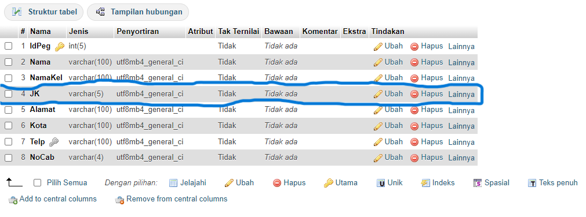

# Hasil Tantangan
## Data Tabel


## Perubahan Struktur Tabel 

### Before


### After


## Perubahan Data Tabel 
### Before pegawai


### After pegawai


### Before cabang


### After cabang 


## Hasil Relasi 


## Query Relasi dan Hasil

### Kode Program
```mysql
SELECT s.nama AS Nama_Siswa, n.nilai AS Nilai
FROM nilai AS n
INNER JOIN siswa AS s ON s.id = n.id_siswa
WHERE n.nilai > 75;
```

### Hasil


