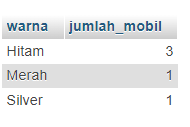
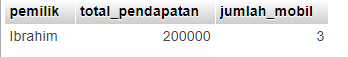

# 1.tampilkan jumlah data mobil dan kelompok kan berdasarkan warna nya sesuai dengan tabel mobil kalian

## Jawab

# 2.berdasarkan query ini tampilkan yang lebih BESAR dari 3 atau sama dengan 3 pemilik mobil nya

## Jawab

# 3.tampilkan smua pemilik dengan jumlah mobilnya yang memiliki atau sama dengan 3 mobil

## Jawab
